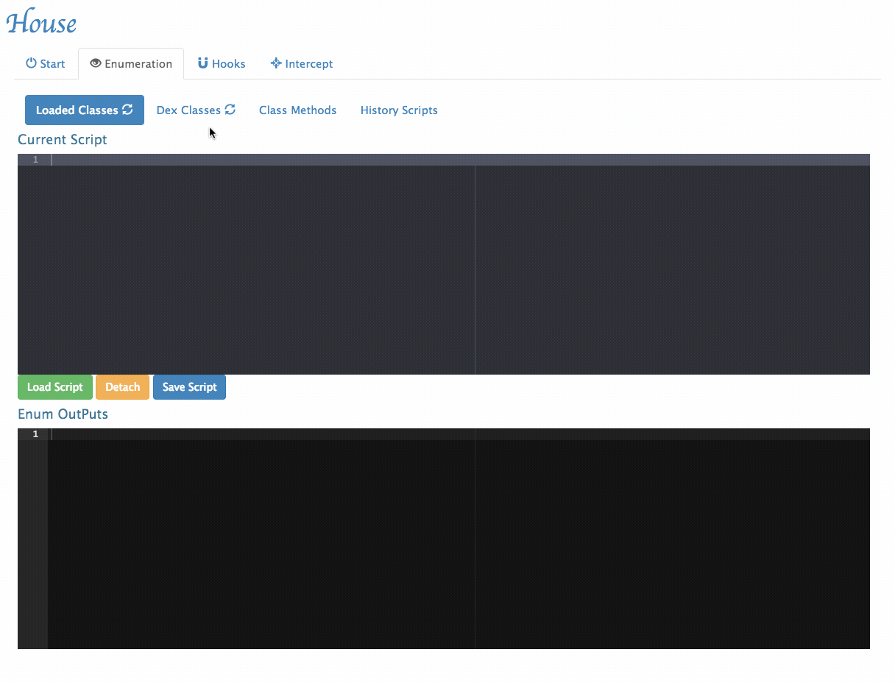
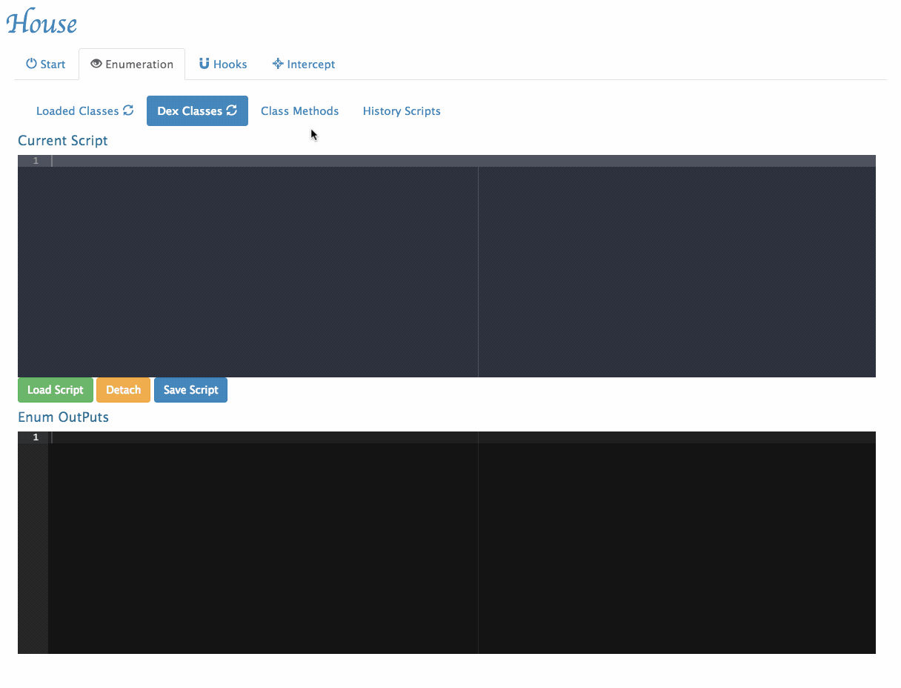
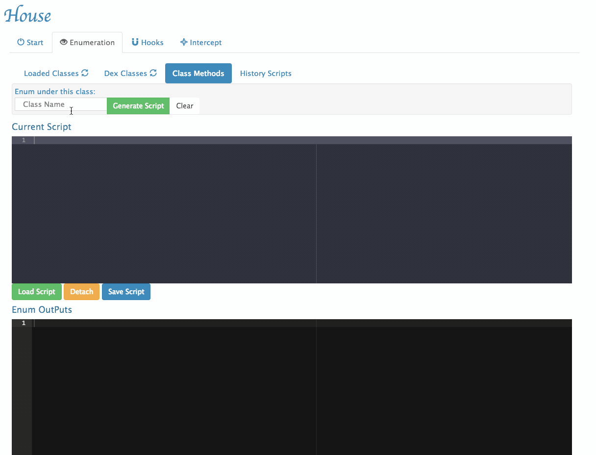
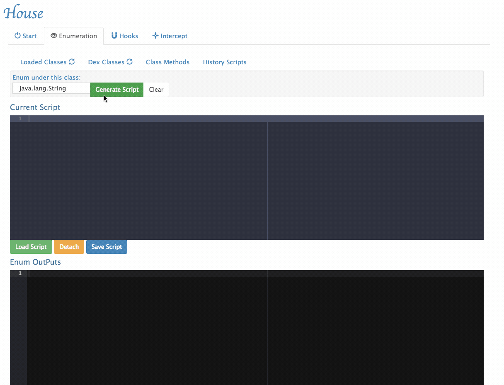
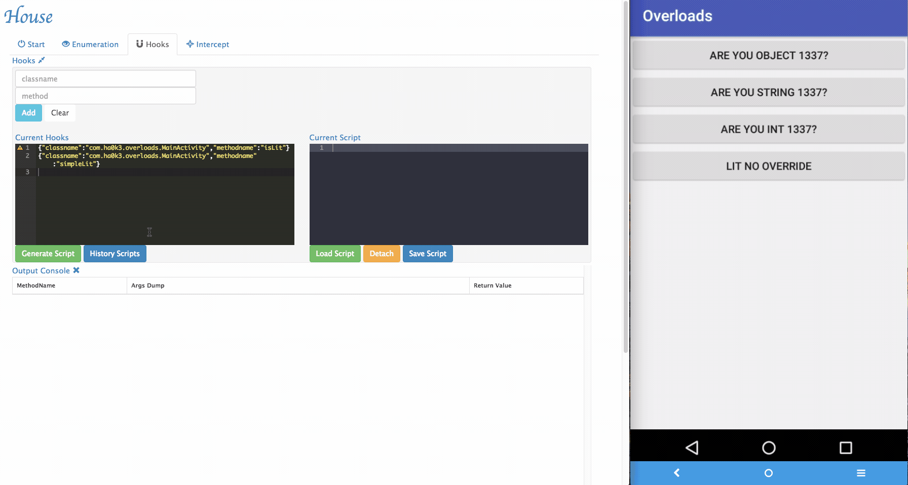
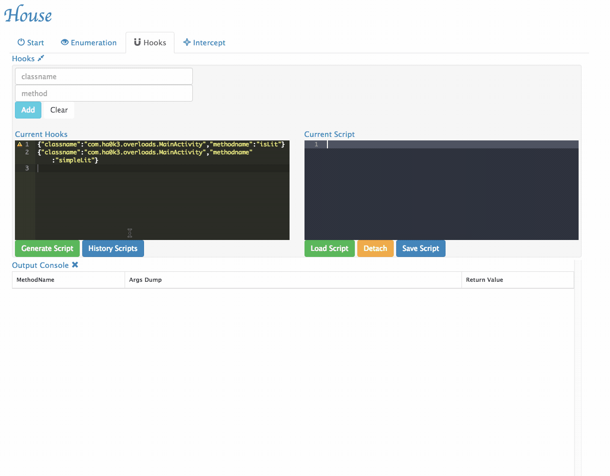
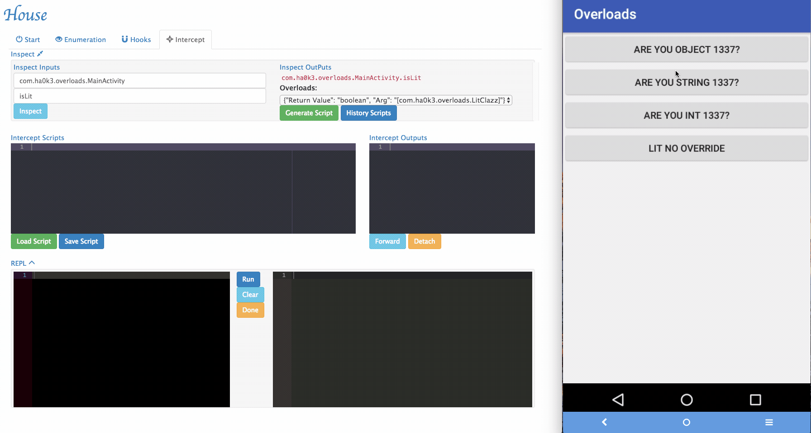
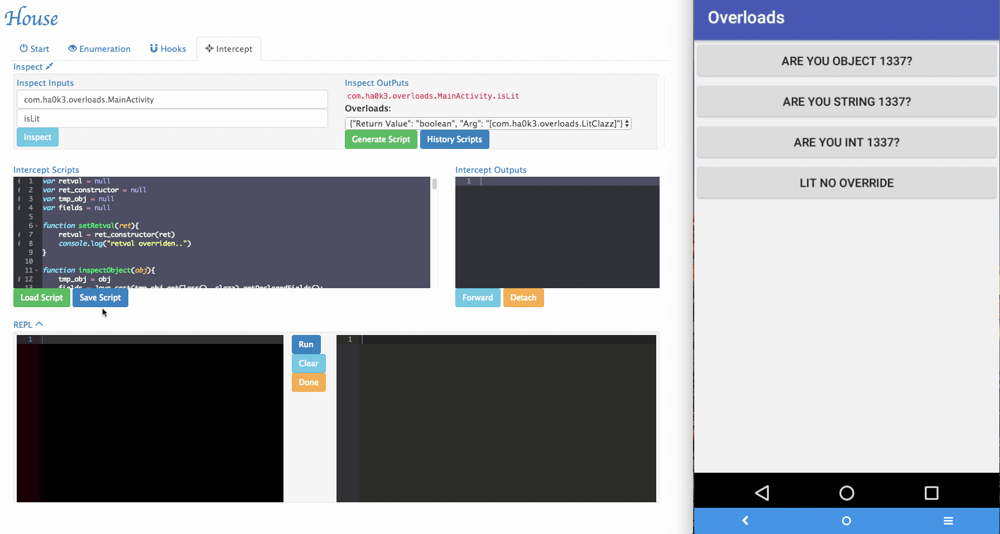

~~~
                  ___ ___
                 /   |   \  ____  __ __  ______ ____
                /    ~    \/  _ \|  |  \/  ___// __ \
                \    Y    (  <_> )  |  /\___ \  ___/
                 \___|_  / \____/|____//____  >\___  >
                       \/      House        \/     \/
                
                    Dynamic Mobile Analysis Tool
                    Contact: hao.ke@nccgroup.trust
~~~

## 
**House**: *A runtime mobile application analysis toolkit with a Web GUI,
powered by Frida, written in Python. It is designed for helping assess mobile
applications by implementing dynamic function hooking and intercepting and
intended to make Frida script writing as simple as possible.*

## TL;DR
~~~
git clone https://github.com/nccgroup/house
pip install pipenv
pipenv install
pipenv shell
python app.py <PORT>
~~~
By default, House binds to http://127.0.0.1:8000.

## Introduction

[Frida](https://frida.re/) is a popular cross-platform dynamic instrumentation
framework. While Frida is a handy tool that enables security researchers to
perform different kinds of dynamic testing, including function hooking and
interception, using it during mobile application assessments can be a chore.
Such work often involves a slow, tedious process of writing Frida scripts
themselves, which primarily take one of two forms: a self-contained tool
leveraging Frida's client APIs, or batches of JavaScript to be injected by one
of the core Frida command-line tools. The former require a fair amount of glue
code to inject the actual scripts, and the latter often results in a large
amount of disorganized hook code. Additionally, in both cases, the JavaScript
code itself often requires a large amount of boilerplate for every function
hook.

To tackle this complexity, I wrote House, a runtime mobile application analysis
toolkit with a Web GUI that is powered by Frida and written in Python. House is
designed for helping assess mobile applications by implementing dynamic function
hooking and intercepting and intended to make Frida script writing as simple as
possible.

## House

[House](https://github.com/nccgroup/house) is an open source web application
that simplifies the testing process with Frida. With House, security
researchers can easily generate Frida scripts to perform various tasks
including enumeration, function hooking and intercepting. It also provides an
easy-to-use web UI for researchers to generate, customize, and manage their
Frida scripts. House is currently focused on Android testing, but the plan
is to extend it in the future to generalize it.

House provides the following key features through its UI by automatically
generating the underlying Frida scripts implementing them:

**Class Enumeration:** Enumerates both defined and loaded Java classes within
an application, with the ability to filter by package name.

**Method Enumeration:** Enumerates all methods within a given class.

**Multiple Function Tracing:** Traces and logs calls to functions declared
through the UI.

**Customize Generated Scripts:** House provides a user interface to tweak
its generated scripts.

**Function Interception:** House provices users with the ability to inspect
and interdict live function calls through the use of hook snippets, an
interception UI, and a live REPL.

## Example Usage

In this section, a small example is provided to illustrate basic usage of
House. The demo case is performed against a small testing android application:
[`com.ha0k3.overloads`](./test_apk/overloads.apk).

#### Start
- Make sure an Android device is plugged in over USB and Frida server is
running on the device. Check the Frida server is successfully spawned using the
following command: `frida-ps -U`.

- Start the House application by running app.py : `python app.py <PORT>`. 

- Open a browser and navigate to <http://127.0.0.1:3137>.

- Observe the device information is displayed on the page, if not, click the
  `Refresh` button or restart the application and Frida server.
  	

#### Enumeration
- *Enumerate all loaded classes:*
	
- *Enumerate all classes in the Dex file:*
	
- *Enumerates all methods within a given class*
	
	
- *History Scripts management*
	
	
#### Multiple Function Tracing
- *Scripts rendering and Function Tracing*
	
	
- *History Scripts management*
	
	
	
#### Function intercepting
- Via House, researchers can dynamically change the arguments being passed to
  the target functions and forward it.
	

- Sometimes House cannot perfectly parse argument informations. For example, an
  arguments can be with special type. In the example app, it implemented
  `isLit` function that takes customized object as its argument. To tackle
  those situations, a simple "REPL" is provided by House. Security researchers
  can dynamically type in Frida script in the REPL and modify the function
  behaviors.
	
	
- Several REPL functions were provided by House to make the testing easier:
	- `inspectObject(obj)` uses `java.lang.reflect` to inspect fields information within an object.
	- `setRetval(ret)` takes a parameter and will try to cast it to the correct return type using the original return value's constructor.
    - `getStackTrace()` will print the stack trace.
	- More REPL functions will be added in the future.

	

**Note:** For constructor method hooking/intercept, input `$init` as method name.

## FAQ 
#### Prerequisite:

To make House work; you would need:

1. A rooted android device with frida-server running plugged in your computer, use only one USB device is recommended.
2. Local frida-python version matches frida-server's.

#### Cannot get device? Does not work?
Make sure you are using **http://127.0.0.1:<PORT>** as the host.
Also please try to restart **both** the frida server and House, if still not working, please file an issue.

#### Time out error?
Often occues when there are multiple USB devices connected, try to restart the target application.

#### Frida error?
House has been tested using Frida version 11.0.9; there might be some issues with some other versions, also make sure frida-python matches frida-server's version. If still not working, try to run the generated frida scripts manually to see if it works.

## Contact
If you have more questions about House, or want to help extending it, feel free to contact:

[@Hao_on_b3at](https://twitter.com/Hao_on_b3at)

Or send an email to: [Hao Ke](mailto:hao.ke@nccgroup.trust?Subject=House)

